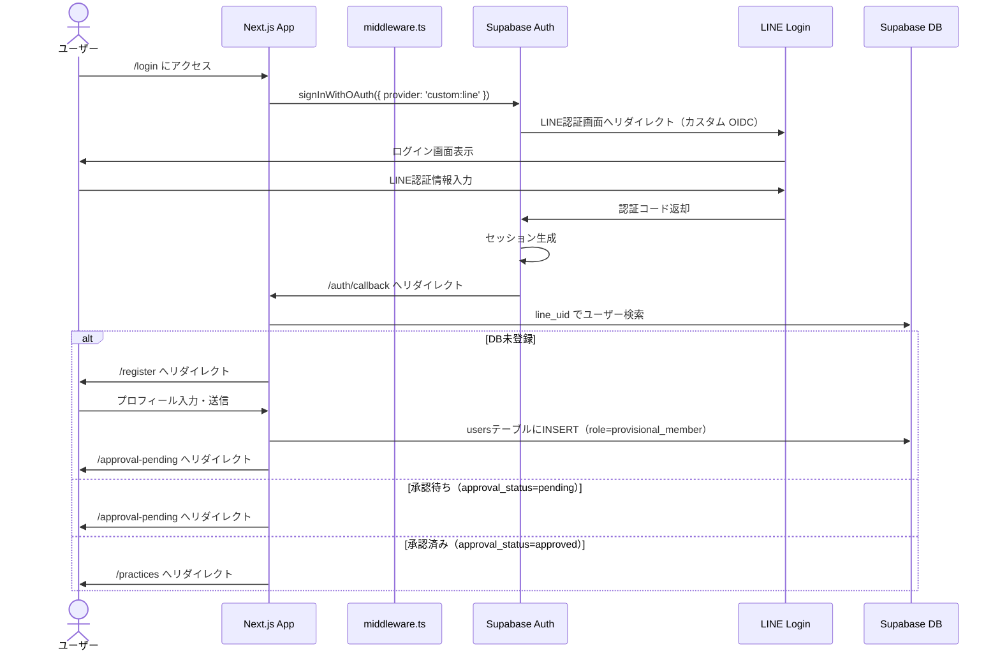

# UnisOno Webアプリ 設計要件ドキュメント

## 概要

クラシックギター合奏の社会人団体「UnisOno」の専用Webアプリケーションの設計基準ドキュメント。
本ドキュメントは既存リポジトリの実装には依存せず、今後の開発における設計の基準として位置づける。

### 主要機能

- **年間スケジュール**: Google Drive の PDF をアプリ上で閲覧・コメント
- **練習予定一覧・記録**: 練習の作成・閲覧・詳細記録
- **出欠回答**: 練習ごとの出欠登録・一覧確認
- **楽曲管理**: 年度ごとの演奏楽曲の管理

### 技術スタック

| 項目 | 技術 |
|------|------|
| 認証 | LINE Login（Supabase Auth経由） |
| データベース | Supabase (PostgreSQL) |
| フロントエンド | Next.js (App Router) |
| セッション管理 | @supabase/ssr |

### ロール体系

3種類のロールを定義: `provisional_member`, `member`, `admin`

---

## 1. 画面構成・ルーティング設計

### 画面一覧

| # | 画面名 | URLパス | 必要ロール | 説明 |
|---|--------|---------|-----------|------|
| 1 | ログイン | `/login` | 未認証 | LINE Loginによるログイン画面 |
| 2 | 新規登録 | `/register` | 認証済み・未登録 | プロフィール入力・会員登録申請 |
| 3 | 承認待ち | `/approval-pending` | provisional_member | メンバーの承認を待つ画面 |
| 4 | ホーム（練習一覧） | `/practices` | member以上 | 練習予定の一覧表示（ホーム画面） |
| 5 | 練習詳細 | `/practices/[id]` | member以上 | 練習の詳細情報・スケジュール・内容 |
| 6 | 出欠回答 | `/practices/[id]/attendance` | member以上 | 自身の出欠を回答 |
| 7 | 出欠一覧 | `/practices/[id]/attendance/list` | member以上 | 練習参加者の出欠一覧 |
| 8 | 練習作成 | `/practices/new` | member以上 | 新規練習の作成 |
| 9 | 練習編集 | `/practices/[id]/edit` | member以上 | 練習基本情報の編集 |
| 10 | 練習詳細編集 | `/practices/[id]/edit-detail` | member以上 | 練習スケジュール・内容の編集 |
| 11 | 年間スケジュール | `/annual` | member以上 | PDF閲覧 + コメント |
| 12 | 楽曲一覧 | `/songs` | member以上 | 年度ごとの楽曲一覧（過去年度も閲覧可） |
| 13 | 楽曲追加 | `/songs/new` | member以上 | 新規楽曲の追加 |
| 14 | 楽曲編集 | `/songs/[id]/edit` | member以上 | 楽曲情報の編集 |
| 15 | プロフィール編集 | `/profile` | member以上 | 自身のプロフィール編集 |
| 16 | 名簿 | `/roster` | member以上 | メンバー一覧表示 |
| 17 | ユーザー管理 | `/admin/users` | admin | ユーザーのロール変更・承認管理 |

### 画面遷移図

```mermaid
stateDiagram-v2
    [*] --> ログイン

    state "未認証" as unauthenticated {
        ログイン --> 新規登録 : LINE認証後\nDB未登録
    }

    state "仮会員" as provisional {
        新規登録 --> 承認待ち : 登録申請完了
    }

    state "承認済みメンバー" as authenticated {
        承認待ち --> 練習一覧 : admin承認後

        ログイン --> 練習一覧 : LINE認証後\nDB登録済み・承認済み

        練習一覧 --> 練習詳細 : 練習選択
        練習詳細 --> 出欠回答 : 出欠回答
        練習詳細 --> 出欠一覧 : 出欠一覧確認
        練習詳細 --> 練習編集 : 編集
        練習詳細 --> 練習詳細編集 : 詳細編集

        練習一覧 --> 練習作成 : 新規作成

        練習一覧 --> 年間スケジュール : ナビゲーション
        練習一覧 --> 楽曲一覧 : ナビゲーション
        楽曲一覧 --> 楽曲追加 : 新規追加
        楽曲一覧 --> 楽曲編集 : 編集

        練習一覧 --> プロフィール編集 : ナビゲーション
        練習一覧 --> 名簿 : ナビゲーション

        state "管理者専用" as admin_area {
            練習一覧 --> ユーザー管理 : adminのみ
        }
    }
```

### ナビゲーション構造

スマートフォン利用を主軸とし、ボトムタブバーによるナビゲーションを採用する。

#### ボトムタブバー（4項目）

| タブ | 遷移先 | アイコン例 |
|------|--------|-----------|
| ホーム | `/practices`（練習一覧） | Home |
| 年間スケジュール | `/annual` | Calendar |
| 曲一覧 | `/songs` | Music |
| 名簿 | `/roster` | Users |

#### ヘッダー右上

- プロフィールアイコン（LINE アバター）を配置
- タップでプロフィール確認・編集画面（`/profile`）へ遷移
- コンテンツ表示を邪魔しない配置とする
- admin の場合、プロフィールメニュー内にユーザー管理への導線を含める

### ホーム画面（練習一覧）の仕様

ホーム画面（`/practices`）はアプリのメイン画面であり、練習予定の一覧を表示する。

#### 一覧の表示項目

| 項目 | 内容 |
|------|------|
| 日付 | 練習日 |
| 時間 | 時間帯（例: "13:00〜17:00"） |
| 場所 | 練習場所 |
| 練習曲 | 紐づけられた楽曲名 |

#### 表示ルール

- 過去の練習も含めて全件表示する
- **初期表示位置は今後の直近の練習予定**（過去分は上方向にスクロールして閲覧）
- 練習日の昇順で並べる
- フィルタリング機能は設けない
- 練習予定が登録されていない場合は、特に何も表示しない（空状態）

#### お知らせ

- メンバー向けの運営アナウンスは LINE グループで引き続き行い、アプリ内には設けない
- アプリ開発側からの一時的なお知らせ（メンテナンス告知等）のみ、フロート表示で対応する
- お知らせ用の DB テーブルは持たず、環境変数等で制御する

### 年間スケジュール画面のレイアウト

年間スケジュール画面（`/annual`）は PDF 閲覧とコメントを同一画面に配置する。

- コメント欄は折りたたみ可能
- **縦画面（ポートレート）**: PDF が上部、コメント欄が下部
- **横画面（ランドスケープ）**: PDF が左部、コメント欄が右部

```
【縦画面】          【横画面】
┌──────────┐      ┌───────┬──────┐
│          │      │       │      │
│   PDF    │      │  PDF  │ コメ │
│          │      │       │ ント │
├──────────┤      │       │      │
│ コメント  │      │       │      │
│ (折りたた │      │       │      │
│  み可)   │      │       │      │
└──────────┘      └───────┴──────┘
```

---

## 2. データベーススキーマ設計

### ER図

```mermaid
erDiagram
    users ||--o{ practices : "created_by"
    users ||--o{ practice_attendances : "user_id"
    users ||--o{ practice_comments : "user_id"
    users ||--o{ annual_schedule_comments : "user_id"
    practices ||--o{ practice_attendances : "practice_id"
    practices ||--o{ practice_comments : "practice_id"
    practices ||--o{ practice_songs : "practice_id"
    songs ||--o{ practice_songs : "song_id"
    songs ||--o{ song_performances : "song_id"
    annual_schedules ||--o{ annual_schedule_comments : "annual_schedule_id"

    users {
        uuid id PK
        text line_uid UK
        text display_name
        text avatar_url
        text nickname
        text family_name
        text given_name
        text old_family_name
        text part
        text class_label
        text affiliation
        text note
        user_role role
        approval_status approval_status
        timestamptz created_at
        timestamptz updated_at
    }

    practices {
        uuid id PK
        text title
        date practice_date
        text time_range
        text location
        timestamptz deadline
        text notes
        jsonb schedule
        jsonb content
        uuid created_by FK
        timestamptz created_at
        timestamptz updated_at
    }

    practice_attendances {
        uuid id PK
        uuid practice_id FK
        uuid user_id FK
        attendance_status status
        text note
        timestamptz updated_at
    }

    practice_comments {
        uuid id PK
        uuid practice_id FK
        uuid user_id FK
        boolean is_anonymous
        text body
        timestamptz created_at
    }

    songs {
        uuid id PK
        text title
        text composer
        text arranger
        int year
        text score_url
        jsonb arrangements
        timestamptz created_at
    }

    song_performances {
        uuid id PK
        uuid song_id FK
        int year
        text event
    }

    practice_songs {
        uuid practice_id PK-FK
        uuid song_id PK-FK
    }

    annual_schedules {
        uuid id PK
        int year UK
        text pdf_url
        timestamptz updated_at
    }

    annual_schedule_comments {
        uuid id PK
        uuid annual_schedule_id FK
        uuid user_id FK
        boolean is_anonymous
        text body
        timestamptz created_at
    }
```

### テーブル定義

#### users（ユーザー）

| カラム名 | 型 | 制約 | 説明 |
|----------|-----|------|------|
| id | uuid | PK | ユーザーID |
| line_uid | text | UNIQUE, NOT NULL | LINE ユーザーID |
| display_name | text | NOT NULL | LINE表示名 |
| avatar_url | text | | LINE プロフィール画像URL（ログイン時に自動更新） |
| nickname | text | NULLABLE | 団体内のニックネーム |
| family_name | text | NOT NULL | 姓 |
| given_name | text | NOT NULL | 名 |
| old_family_name | text | NULLABLE | 旧姓 |
| part | text | NOT NULL | 担当パート |
| class_label | text | NOT NULL | 期（例: "1期", "2期"） |
| affiliation | text | NULLABLE | 所属（例: 大学名・勤務先など） |
| note | text | NULLABLE | 自由記述（例: 「xxxx年x月までお休み」） |
| role | user_role | NOT NULL, DEFAULT 'provisional_member' | ユーザーロール |
| approval_status | approval_status | NOT NULL, DEFAULT 'pending' | 承認ステータス |
| created_at | timestamptz | NOT NULL, DEFAULT now() | 作成日時 |
| updated_at | timestamptz | NOT NULL, DEFAULT now() | 更新日時 |

#### practices（練習）

| カラム名 | 型 | 制約 | 説明 |
|----------|-----|------|------|
| id | uuid | PK | 練習ID |
| title | text | NOT NULL | 練習タイトル |
| practice_date | date | NOT NULL | 練習日 |
| time_range | text | NOT NULL | 時間帯（例: "13:00〜17:00"） |
| location | text | NOT NULL | 場所 |
| deadline | timestamptz | | 出欠回答締切日時 |
| notes | text | | 備考 |
| schedule | jsonb | | 練習当日のタイムスケジュール |
| content | jsonb | | 練習内容の詳細 |
| created_by | uuid | FK → users(id), NOT NULL | 作成者 |
| created_at | timestamptz | NOT NULL, DEFAULT now() | 作成日時 |
| updated_at | timestamptz | NOT NULL, DEFAULT now() | 更新日時 |

#### practice_attendances（出欠）

| カラム名 | 型 | 制約 | 説明 |
|----------|-----|------|------|
| id | uuid | PK | 出欠ID |
| practice_id | uuid | FK → practices(id), NOT NULL | 練習ID |
| user_id | uuid | FK → users(id), NOT NULL | ユーザーID |
| status | attendance_status | NOT NULL | 出欠ステータス |
| note | text | | 備考（遅刻・早退等） |
| updated_at | timestamptz | NOT NULL, DEFAULT now() | 更新日時 |

> **制約**: UNIQUE(practice_id, user_id) — 1ユーザー1練習につき1レコード

#### practice_comments（練習コメント）

| カラム名 | 型 | 制約 | 説明 |
|----------|-----|------|------|
| id | uuid | PK | コメントID |
| practice_id | uuid | FK → practices(id), NOT NULL | 練習ID |
| user_id | uuid | FK → users(id), NOT NULL | 投稿者 |
| is_anonymous | boolean | NOT NULL, DEFAULT false | 匿名投稿フラグ |
| body | text | NOT NULL | コメント本文 |
| created_at | timestamptz | NOT NULL, DEFAULT now() | 投稿日時 |

#### songs（楽曲）

| カラム名 | 型 | 制約 | 説明 |
|----------|-----|------|------|
| id | uuid | PK | 楽曲ID |
| title | text | NOT NULL | 楽曲タイトル |
| composer | text | | 作曲者 |
| arranger | text | | 編曲者 |
| year | int | | 作曲年 |
| score_url | text | | 楽譜URL |
| arrangements | jsonb | | 編成リスト（例: `["Gt.I×2, Gt.II×2, Gt.III×2", "Gt.I×3, Gt.II×1"]`） |
| created_at | timestamptz | NOT NULL, DEFAULT now() | 作成日時 |

#### song_performances（楽曲演奏履歴）

| カラム名 | 型 | 制約 | 説明 |
|----------|-----|------|------|
| id | uuid | PK | 演奏履歴ID |
| song_id | uuid | FK → songs(id), NOT NULL | 楽曲ID |
| year | int | NOT NULL | 演奏年 |
| event | text | NOT NULL | イベント名（コンクール、ロビコン、風待ち/虹晴れ、葡萄園、その他） |

#### practice_songs（練習×楽曲 中間テーブル）

| カラム名 | 型 | 制約 | 説明 |
|----------|-----|------|------|
| practice_id | uuid | PK, FK → practices(id) | 練習ID |
| song_id | uuid | PK, FK → songs(id) | 楽曲ID |

> **制約**: PRIMARY KEY(practice_id, song_id)

#### annual_schedules（年間スケジュール）

| カラム名 | 型 | 制約 | 説明 |
|----------|-----|------|------|
| id | uuid | PK | スケジュールID |
| year | int | UNIQUE, NOT NULL | 年度 |
| pdf_url | text | NOT NULL | Google Drive プレビューURL |
| updated_at | timestamptz | NOT NULL, DEFAULT now() | 更新日時 |

#### annual_schedule_comments（年間スケジュールコメント）

| カラム名 | 型 | 制約 | 説明 |
|----------|-----|------|------|
| id | uuid | PK | コメントID |
| annual_schedule_id | uuid | FK → annual_schedules(id), NOT NULL | スケジュールID |
| user_id | uuid | FK → users(id), NOT NULL | 投稿者 |
| is_anonymous | boolean | NOT NULL, DEFAULT false | 匿名投稿フラグ |
| body | text | NOT NULL | コメント本文 |
| created_at | timestamptz | NOT NULL, DEFAULT now() | 投稿日時 |

### Enum定義

#### user_role

| 値 | 説明 |
|----|------|
| provisional_member | 仮会員（承認待ち） |
| member | メンバー |
| admin | 管理者 |

#### approval_status

| 値 | 説明 |
|----|------|
| pending | 承認待ち |
| approved | 承認済み |

#### attendance_status

| 値 | 説明 |
|----|------|
| attending | 出席 |
| undecided | 未定 |
| absent | 欠席 |

---

## 3. 認証フロー

### 認証シーケンス図



### セッション管理

#### @supabase/ssr によるサーバーサイドセッション管理

| 項目 | 内容 |
|------|------|
| セッション保持方式 | Cookie（HttpOnly, Secure, SameSite=Lax） |
| セッション更新 | @supabase/ssr の `createServerClient` で自動リフレッシュ |
| セッション取得 | Server Components / Route Handlers から `supabase.auth.getUser()` で取得 |

#### middleware.ts でのセッション検証とリダイレクトロジック

| 条件 | リダイレクト先 |
|------|---------------|
| 未認証 & 保護ページへアクセス | `/login` |
| 認証済み & DB未登録 & `/register`以外へアクセス | `/register` |
| provisional_member & 承認待ち & 一般ページへアクセス | `/approval-pending` |
| 認証済み & `/login`へアクセス | `/practices` |
| 上記以外 | そのままアクセス許可 |

---

## 4. 権限モデル

### ロール定義

| ロール | 説明 | 主要な権限 |
|--------|------|-----------|
| provisional_member | 仮会員（承認待ち） | プロフィール閲覧のみ |
| member | メンバー | 練習閲覧・作成・編集、出欠回答、コメント投稿、楽曲管理、新規メンバーの承認 |
| admin | 管理者 | member権限 + ロール変更 |

### 画面 × ロール 権限マトリクス

| 画面名 | provisional_member | member | admin |
|--------|:-:|:-:|:-:|
| ログイン | - | - | - |
| 新規登録 | - | - | - |
| 承認待ち | 閲覧 ○ | - | - |
| 練習一覧 | × | 閲覧 ○ | 閲覧 ○ |
| 練習詳細 | × | 閲覧 ○ | 閲覧 ○ |
| 出欠回答 | × | 操作 ○ | 操作 ○ |
| 出欠一覧 | × | 閲覧 ○ | 閲覧 ○ |
| 練習作成 | × | 操作 ○ | 操作 ○ |
| 練習編集 | × | 操作 ○ | 操作 ○ |
| 練習詳細編集 | × | 操作 ○ | 操作 ○ |
| 年間スケジュール | × | 閲覧 ○ / コメント ○ | 閲覧 ○ / コメント ○ |
| 楽曲一覧 | × | 閲覧 ○ | 閲覧 ○ |
| 楽曲追加 | × | 操作 ○ | 操作 ○ |
| 楽曲編集 | × | 操作 ○ | 操作 ○ |
| プロフィール編集 | × | 操作 ○ | 操作 ○ |
| 名簿 | × | 閲覧 ○ | 閲覧 ○ |
| ユーザー管理（承認） | × | 操作 ○ | 操作 ○ |
| ユーザー管理（ロール変更） | × | × | 操作 ○ |

---

## 5. RLSポリシー設計

### users テーブル

| 操作 | ポリシー | 条件 |
|------|----------|------|
| SELECT | member以上は全員閲覧可 | `auth.uid() IN (SELECT id FROM users WHERE role IN ('member','admin') AND approval_status = 'approved')` |
| INSERT | 認証済みユーザーが自身のレコードを作成 | `auth.uid() = id` |
| UPDATE | 自身のプロフィール項目のみ更新可 | `auth.uid() = id`（role, approval_status カラムを除く） |
| UPDATE | member以上はapproval_statusを変更可 | `auth.uid() IN (SELECT id FROM users WHERE role IN ('member','admin') AND approval_status = 'approved')` |
| UPDATE | adminはroleを変更可 | `auth.uid() IN (SELECT id FROM users WHERE role = 'admin')` |
| DELETE | 不可 | なし |

### practices テーブル

| 操作 | ポリシー | 条件 |
|------|----------|------|
| SELECT | member以上は全件閲覧可 | ユーザーのroleがmember以上かつapproval_status = 'approved' |
| INSERT | member以上が作成可 | ユーザーのroleがmember以上 |
| UPDATE | member以上が更新可 | ユーザーのroleがmember以上 |
| DELETE | admin のみ削除可 | ユーザーのroleがadmin |

### practice_attendances テーブル

| 操作 | ポリシー | 条件 |
|------|----------|------|
| SELECT | member以上は全件閲覧可 | ユーザーのroleがmember以上かつapproval_status = 'approved' |
| INSERT | 自身の出欠のみ作成可 | `auth.uid() = user_id` かつ member以上 |
| UPDATE | 自身の出欠のみ更新可 | `auth.uid() = user_id` かつ member以上 |
| DELETE | 不可 | なし |

### practice_comments テーブル

| 操作 | ポリシー | 条件 |
|------|----------|------|
| SELECT | member以上は全件閲覧可 | ユーザーのroleがmember以上かつapproval_status = 'approved' |
| INSERT | member以上が投稿可 | `auth.uid() = user_id` かつ member以上 |
| UPDATE | 不可 | なし（コメントは編集不可） |
| DELETE | 投稿者本人またはadminが削除可 | `auth.uid() = user_id` または admin |

### songs テーブル

| 操作 | ポリシー | 条件 |
|------|----------|------|
| SELECT | member以上は全件閲覧可 | ユーザーのroleがmember以上 |
| INSERT | member以上が作成可 | ユーザーのroleがmember以上 |
| UPDATE | member以上が更新可 | ユーザーのroleがmember以上 |
| DELETE | admin のみ削除可 | ユーザーのroleがadmin |

### song_performances テーブル

| 操作 | ポリシー | 条件 |
|------|----------|------|
| SELECT | member以上は全件閲覧可 | ユーザーのroleがmember以上 |
| INSERT | member以上が作成可 | ユーザーのroleがmember以上 |
| UPDATE | member以上が更新可 | ユーザーのroleがmember以上 |
| DELETE | member以上が削除可 | ユーザーのroleがmember以上 |

### practice_songs テーブル

| 操作 | ポリシー | 条件 |
|------|----------|------|
| SELECT | member以上は全件閲覧可 | ユーザーのroleがmember以上 |
| INSERT | member以上が作成可 | ユーザーのroleがmember以上 |
| DELETE | member以上が削除可 | ユーザーのroleがmember以上 |

### annual_schedules テーブル

| 操作 | ポリシー | 条件 |
|------|----------|------|
| SELECT | member以上は全件閲覧可 | ユーザーのroleがmember以上 |
| INSERT | admin のみ作成可 | ユーザーのroleがadmin |
| UPDATE | admin のみ更新可 | ユーザーのroleがadmin |
| DELETE | 不可 | なし |

### annual_schedule_comments テーブル

| 操作 | ポリシー | 条件 |
|------|----------|------|
| SELECT | member以上は全件閲覧可 | ユーザーのroleがmember以上かつapproval_status = 'approved' |
| INSERT | member以上が投稿可 | `auth.uid() = user_id` かつ member以上 |
| UPDATE | 不可 | なし（コメントは編集不可） |
| DELETE | 投稿者本人またはadminが削除可 | `auth.uid() = user_id` または admin |

---

## 6. API設計方針

### 基本方針

| 方針 | 説明 |
|------|------|
| データアクセスの基本 | Supabase Client SDK を使用したRLS保護下でのダイレクトDB呼び出し |
| 複雑なビジネスロジック | Supabase Edge Functions または Next.js Server Actions で処理 |
| データフェッチ | Server Components 内で `createServerClient` を使用しサーバーサイドで取得 |
| ミューテーション | Server Actions を使用し、`revalidatePath` でキャッシュを更新 |

### データフェッチパターン

```
Server Component
  └─ createServerClient() でSupabaseクライアント生成
      └─ supabase.from('table').select() でデータ取得（RLSが自動適用）
          └─ 取得したデータをClient Componentへpropsとして渡す
```

### Server Actions を使うケース

- 出欠の回答・更新
- 練習の作成・編集
- プロフィールの更新
- 楽曲の追加・編集
- コメントの投稿・削除
- ユーザーのロール変更・承認（admin）
- 年間スケジュールの PDF URL 登録・更新（admin）

### Edge Functions を使うケース

- LINE Login コールバック処理（ユーザーの新規登録判定）
- 複数テーブルにまたがるトランザクション処理

### ディレクトリ構成

```
src/
├── app/
│   ├── (auth)/
│   │   ├── login/
│   │   ├── register/
│   │   ├── approval-pending/
│   │   └── auth/callback/
│   ├── (main)/
│   │   ├── practices/
│   │   ├── annual/
│   │   ├── songs/
│   │   ├── profile/
│   │   ├── roster/
│   │   └── admin/
│   ├── layout.tsx
│   └── page.tsx
├── features/
│   ├── practices/
│   │   └── api/          # 練習関連のデータアクセス・Server Actions
│   ├── attendance/
│   │   └── api/          # 出欠関連のデータアクセス・Server Actions
│   ├── users/
│   │   └── api/          # ユーザー関連のデータアクセス・Server Actions
│   ├── annual/
│   │   └── api/          # 年間スケジュール関連のデータアクセス・Server Actions
│   ├── songs/
│   │   └── api/          # 楽曲関連のデータアクセス・Server Actions
│   └── comments/
│       └── api/          # コメント関連のデータアクセス・Server Actions
├── components/
│   └── ui/               # 共通UIコンポーネント
├── lib/
│   └── supabase/
│       ├── server.ts     # createServerClient ヘルパー
│       └── client.ts     # createBrowserClient ヘルパー
└── middleware.ts          # セッション検証・リダイレクト
```

### 各featureのAPI概要

#### practices/api/

| 関数名 | 種別 | 説明 |
|--------|------|------|
| getPractices | データフェッチ | 練習一覧取得 |
| getPracticeById | データフェッチ | 練習詳細取得 |
| createPractice | Server Action | 練習作成 |
| updatePractice | Server Action | 練習基本情報更新 |
| updatePracticeDetail | Server Action | 練習スケジュール・内容更新 |

#### attendance/api/

| 関数名 | 種別 | 説明 |
|--------|------|------|
| getAttendancesByPractice | データフェッチ | 練習ごとの出欠一覧取得 |
| getMyAttendance | データフェッチ | 自身の出欠取得 |
| upsertAttendance | Server Action | 出欠の回答・更新 |

#### users/api/

| 関数名 | 種別 | 説明 |
|--------|------|------|
| getCurrentUser | データフェッチ | ログインユーザー情報取得 |
| getUsers | データフェッチ | ユーザー一覧取得 |
| updateProfile | Server Action | プロフィール更新 |
| approveUser | Server Action | ユーザー承認（member以上） |
| updateUserRole | Server Action | ロール変更（admin のみ） |

#### annual/api/

| 関数名 | 種別 | 説明 |
|--------|------|------|
| getAnnualSchedule | データフェッチ | 年間スケジュール取得（PDF URL含む） |
| upsertAnnualSchedule | Server Action | PDF URL の登録・更新（admin） |

#### songs/api/

| 関数名 | 種別 | 説明 |
|--------|------|------|
| getSongs | データフェッチ | 楽曲一覧取得（年度・イベントフィルタ対応） |
| getSongById | データフェッチ | 楽曲詳細取得（演奏履歴含む） |
| createSong | Server Action | 楽曲追加 |
| updateSong | Server Action | 楽曲編集 |
| deleteSong | Server Action | 楽曲削除（admin） |
| addPerformance | Server Action | 演奏履歴の追加 |
| removePerformance | Server Action | 演奏履歴の削除 |

#### comments/api/

| 関数名 | 種別 | 説明 |
|--------|------|------|
| getCommentsByPractice | データフェッチ | 練習コメント一覧取得 |
| getCommentsByAnnualSchedule | データフェッチ | 年間スケジュールコメント一覧取得 |
| createPracticeComment | Server Action | 練習コメント投稿 |
| createAnnualScheduleComment | Server Action | 年間スケジュールコメント投稿 |
| deleteComment | Server Action | コメント削除（本人またはadmin） |
