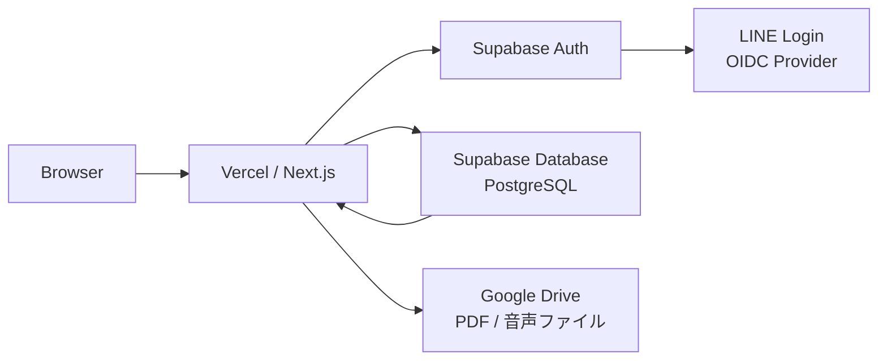

# 技術スタック

## 1. 概要

本ドキュメントは、クラシックギター合奏の社会人団体「UnisOno」専用Webアプリにおける技術選定の基準ドキュメントである。

アプリの目的は、年間スケジュール・練習予定/記録・出欠回答・楽曲管理を一箇所に集約し、団体運営の効率化を図ることにある。今後の開発では本ドキュメントに記載された技術スタックを基準として採用・実装を進める。

---

## 2. アーキテクチャ概観

| レイヤー | 役割 |
|---|---|
| Browser | ユーザーインターフェース（React / Next.js） |
| Vercel / Next.js | SSR・API Routes・静的配信 |
| Supabase Auth | 認証・セッション管理（LINE Login 連携） |
| Supabase Database | データ永続化（PostgreSQL + RLS） |
| LINE Login | OIDC による外部認証 |
| Google Drive | 年間スケジュール PDF の配信元（iframe 埋め込みで閲覧） |

---

## 3. フロントエンド

### Next.js (App Router)

- **選定理由**: Server Components によるパフォーマンス最適化、Vercel との高い親和性、ファイルベースルーティングによる開発効率
- App Router を採用し、Server Components をデフォルトとする

### React

- **選定理由**: Server Components / Suspense 対応によるデータフェッチの最適化、豊富なエコシステム
- Server Components を積極活用し、クライアントコンポーネントは必要最小限に留める

### TypeScript

- **選定理由**: 型安全性による開発時のバグ防止、IDE補完の向上、チーム開発における可読性確保
- `strict: true` を有効にする

### Tailwind CSS

- **選定理由**: ユーティリティファーストによる高速なスタイリング、ビルド時の未使用CSS除去、デザイントークンの一元管理
- カスタムテーマでブランドカラー等を定義する

### lucide-react

- **選定理由**: 軽量・Tree-shakable なアイコンライブラリ、シンプルで統一感のあるデザイン

### UIコンポーネント方針

- **基本方針**: Button、Input、Card などの基本コンポーネントは自作する
- **補助的利用**: 複雑なコンポーネント（Dialog、Dropdown、DatePicker 等）は必要に応じて [shadcn/ui](https://ui.shadcn.com/) を導入する
- shadcn/ui はコピー&ペースト方式のため、依存を最小限に保ちつつカスタマイズが容易

---

## 4. バックエンド / BaaS

### Supabase

| 機能 | 用途 |
|---|---|
| PostgreSQL | リレーショナルデータの永続化 |
| Auth | 認証・セッション管理 |
| Edge Functions | サーバーサイドロジック（必要時） |
| Row Level Security (RLS) | テーブル単位のアクセス制御 |
| Realtime | リアルタイムデータ同期（出欠状況の即時反映等） |

- **選定理由**:
  - RLS によるセキュアなデータアクセス制御をDB層で実現
  - Realtime 機能で出欠状況などのリアルタイム反映が可能
  - 無料枠が十分に広く、小規模団体の運用に適する
  - PostgreSQL ベースのため、将来的な移行も容易

### 使用パッケージ

- `@supabase/supabase-js` — Supabase クライアント（ブラウザ・サーバー共通）
- `@supabase/ssr` — Next.js App Router 向けの SSR/Cookie ヘルパー

---

## 5. 認証

### Supabase Auth + LINE Login（カスタム OIDC プロバイダー）

- LINE Login は Supabase の組み込みプロバイダーには含まれないため、**カスタム OIDC プロバイダー**として設定する
- Supabase ダッシュボード上で LINE の OIDC 情報（Issuer URL: `https://access.line.me`）を登録
- アプリ側では `signInWithOAuth({ provider: 'custom:line' })` で呼び出す
- LINE Login のチャネル ID / シークレットは Supabase ダッシュボードに設定済みのため、アプリの環境変数には不要

### 環境変数一覧

| 環境変数名 | 用途 | 公開範囲 |
|---|---|---|
| `NEXT_PUBLIC_SUPABASE_URL` | Supabase プロジェクト URL | クライアント公開 |
| `NEXT_PUBLIC_SUPABASE_PUBLISHABLE_KEY` | Supabase 公開キー | クライアント公開 |
| `SUPABASE_SERVICE_ROLE_KEY` | Supabase サービスロールキー | サーバーのみ |

> **注意**: `SUPABASE_SERVICE_ROLE_KEY` はサーバーサイドでのみ使用し、クライアントに露出させないこと。

---

## 6. 外部サービス連携

### Google Drive（年間スケジュール PDF）

- 年間スケジュールは Google Drive にアップロードされた PDF を iframe で表示する
- 共有設定を「リンクを知っている全員が閲覧可能」にし、プレビュー URL（`/preview`）を使用する
- アプリ側にファイル編集機能は設けず、PDF の作成・更新は Google Drive 上で行う

---

## 7. ホスティング / インフラ

### Vercel

- **選定理由**: Next.js の公式ホスティングプラットフォーム、ゼロコンフィグデプロイ、Preview Deployments による PR 単位のプレビュー環境
- Hobby プラン（無料）で運用を開始し、必要に応じてスケールアップ

### Supabase

- **役割**: マネージド PostgreSQL + 認証 + リアルタイム基盤
- Free プランで運用を開始（500MB DB、50,000 MAU、500MB ストレージ）

---

## 8. CI/CD

### GitHub Actions

以下のワークフローを PR 作成時・push 時に自動実行する。

| ステップ | コマンド例 | 目的 |
|---|---|---|
| Lint | `npx eslint .` | コード品質チェック |
| Type Check | `npx tsc --noEmit` | 型エラーの検出 |
| Build | `npx next build` | ビルド成功の確認 |
| Test | `npx vitest run` | ユニットテストの実行 |

- `main` ブランチへのマージで Vercel が自動デプロイを実行する
- PR 作成時に Vercel の Preview Deployment が自動生成される

---

## 9. 追加導入候補ライブラリ

### テスト

| ライブラリ | 用途 | 選定理由 |
|---|---|---|
| Vitest | ユニットテスト | Vite ベースで高速、Jest 互換 API |
| Testing Library | コンポーネントテスト | ユーザー視点のテスト記述が可能 |
| Playwright | E2E テスト | クロスブラウザ対応、安定性が高い |

### フォーム

| ライブラリ | 用途 | 選定理由 |
|---|---|---|
| React Hook Form | フォーム状態管理 | 非制御コンポーネントベースで高パフォーマンス |
| Zod | スキーマバリデーション | TypeScript ファーストな型推論、RHF との統合が容易 |

### 状態管理方針

- **Server State**: Supabase からのデータ取得は Server Components で直接行い、クライアントキャッシュライブラリ（TanStack Query 等）は原則不要とする
- **Client State**: フォーム入力やUI状態など、最小限の範囲で `useState` / `useReducer` を使用する
- グローバル状態管理ライブラリ（Redux、Zustand 等）は現時点では導入しない。必要性が生じた場合に再検討する

---

## 10. バージョン一覧表

プロジェクト初期化時にインストールされたバージョンを正とする。以下は 2026年4月時点の参考値。

| パッケージ | 推奨バージョン | 備考 |
|---|---|---|
| Node.js | 22.x (LTS) または最新安定版 | 開発環境に合わせる |
| Next.js | 16.x | App Router 安定版 |
| React | 19.x | Server Components 正式対応 |
| TypeScript | 5.x | 最新安定版 |
| Tailwind CSS | 4.x | v4 安定版 |
| lucide-react | 最新安定版 | — |
| @supabase/supabase-js | 2.x | 最新安定版 |
| @supabase/ssr | 0.x | Next.js App Router 対応 |
| React Hook Form | 7.x | 最新安定版 |
| Zod | 3.x | 最新安定版 |
| Vitest | 3.x | 最新安定版 |
| @testing-library/react | 16.x | React 19 対応 |
| Playwright | 1.x | 最新安定版 |
| ESLint | 最新安定版 | Flat Config 対応 |

> **注意**: 上記バージョンは参考値であり、固定ではない。互換性を検証した上で採用すること。
